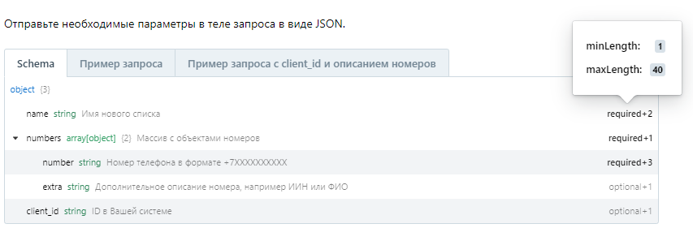
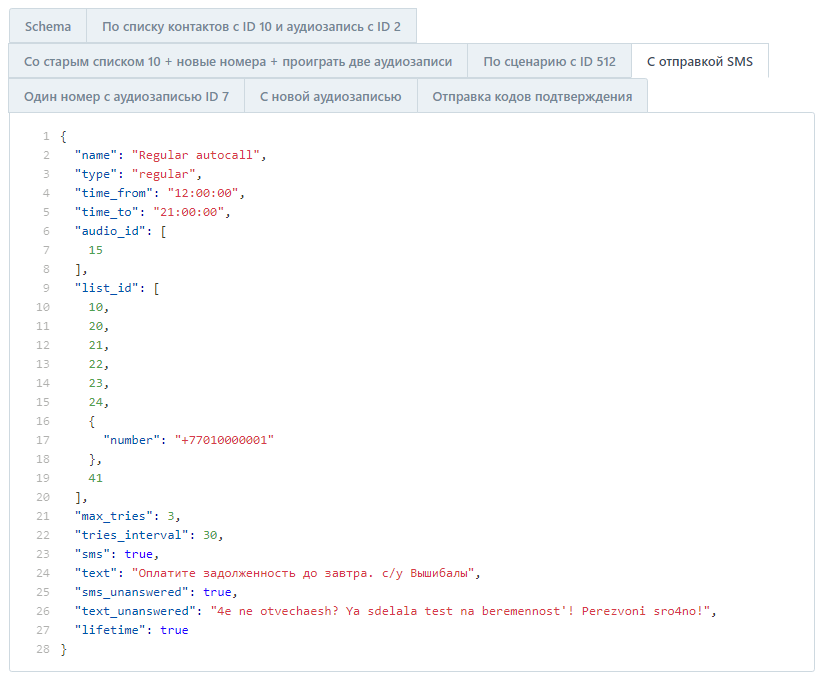
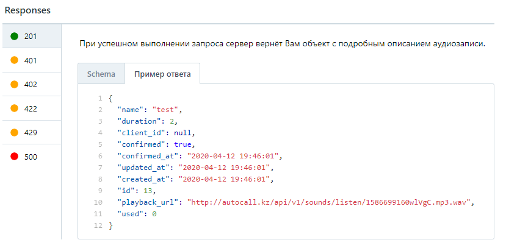
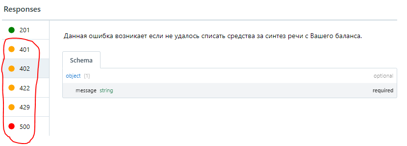
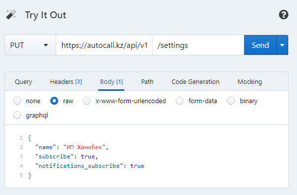
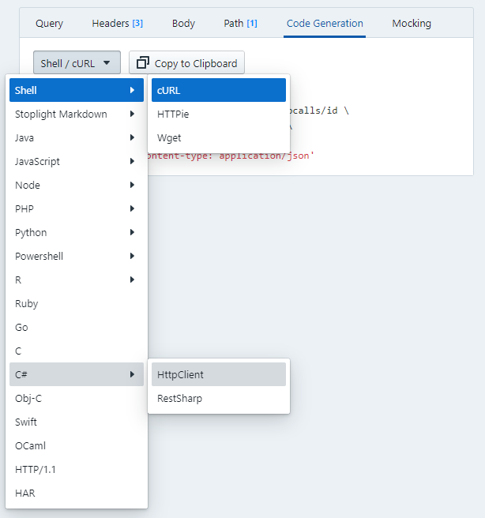
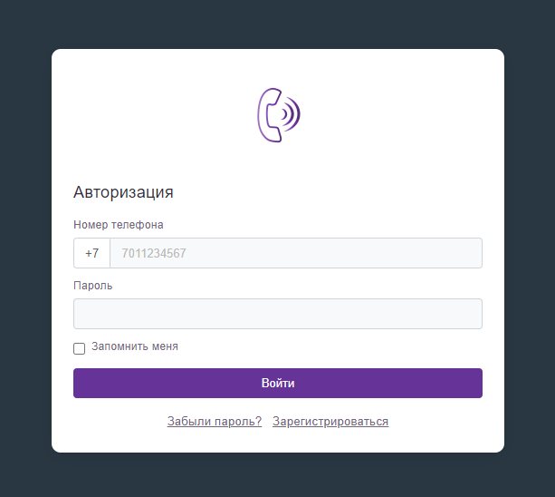

# Перед началом работы

> Эта страница о том, обо что чаще всего спотыкаются при интеграции с API AutoCall.kz.
> Пять минут чтения сэкономят вам несколько обращений в поддержку.

## 1. Время рассылок

По умолчанию аккаунт может звонить и отправлять сообщения в интервале, заданном вашим тарифом.
На базовом тарифе это с `11:00` до `21:00`, на старших — шире; точные значения указаны в
[тарифах](https://autocall.kz/tarify).

Если в запросе указать время за пределами этого интервала, API вернёт `422` с описанием поля,
которое не прошло проверку. Круглосуточная отправка — например, для кодов подтверждения —
включается индивидуально: напишите в поддержку, и мы выставим нужный интервал.

## 2. Спам

AutoCall.kz не является и никогда не являлся спам-сервисом.

Рассылки без согласия получателей мы не допускаем. При обнаружении таких действий к аккаунту
применяются штрафы вплоть до судебного иска: при регистрации по номеру телефона мы уже
располагаем данными владельца аккаунта.

Прежде чем начинать интеграцию, убедитесь, что ваш сценарий не нарушает
[пользовательское соглашение](https://autocall.kz/agreement).

## 3. Ограничение частоты запросов

API принимает `300` запросов в минуту. Запросы сверх лимита отклоняются со статусом
`429 Too Many Requests`. Если вашему приложению нужен более высокий предел, обратитесь в
поддержку — лимит настраивается для аккаунта индивидуально.

Предусмотрите в коде обработку `429` и повтор с задержкой: это стандартная практика и она
избавит вас от потери запросов на пиках.

## 4. Сроки модерации

Каждая рассылка проходит проверку перед выходом в эфир. Часть решений модераторы принимают
сразу, но в спорных случаях им приходится консультироваться с юристами, и это занимает время.

Чтобы ускорить процесс, мы используем ИИ для предварительного анализа. Если материал очевидно
безопасен, не нарушает [пользовательское соглашение](https://autocall.kz/agreement), не задевает
честь и достоинство граждан и не противоречит законам «О рекламе» и «О связи», проверка проходит
мгновенно. Во всех остальных случаях материал уходит к живому модератору.

Закладывайте это время в свои сценарии: рассылка, созданная через API, не начинает звонить
в ту же секунду.

## 5. SMS-уведомления в личном кабинете

После интеграции ваш номер начнёт получать сообщения вида «Обзвон НАЗВАНИЕ завершён» или
«Рассылка НАЗВАНИЕ завершена» — по одному на каждую кампанию. При работе через API их
становится много.

Отключить их можно в настройках личного кабинета. Для отслеживания статусов используйте
`callback_url`: он сообщает то же самое, но в ваше приложение и без SMS.

## 6. Как читать эту документацию

Документация составлена по стандарту REST API и содержит всё необходимое для интеграции.
Несколько подсказок, которые сокращают путь:

Наведите курсор на `required`, чтобы увидеть подробности о поле.

Просмотрите примеры запросов — их можно скопировать и подогнать под свою задачу.

Изучите пример ответа, чтобы заранее знать, какие данные вернутся.

Разберите возможные статусы ответов и обработайте их в приложении.

Панель «Try it out» позволяет вызвать метод прямо из документации, не написав ни строки кода.

Функция «Code Generation» выдаёт готовый сниппет на вашем языке программирования.

Прежде чем интегрироваться, попробуйте нужный сценарий в веб-версии: так быстрее понять,
какой результат вы хотите получить через API.

---

Если после этой страницы вопросы остались — напишите в поддержку. Мы отвечаем.